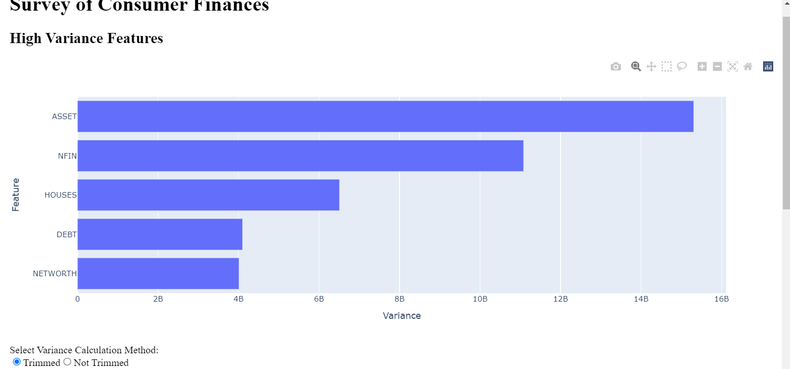
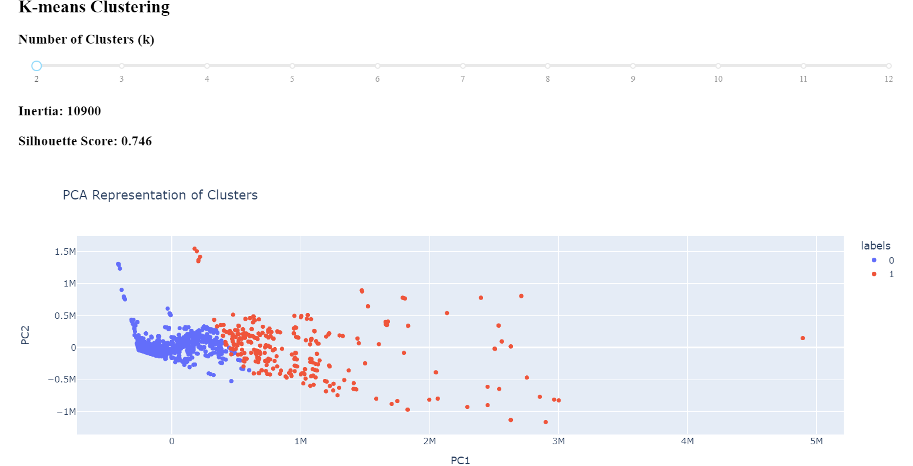

# Credit Fear Clustering: Exploring Household Financial Behavior
This notebook explores household financial behavior using data from the Survey of Consumer Finances (SCF). My goal is to segment households into distinct groups based on credit fearfulness, analyzing characteristics such as assets, income, race, age, and debt.

## Overview

This Dash application performs K-Means clustering on a dataset, allowing users to explore high-variance features and determine whether to trim them before clustering. It also provides interactive visualizations, including a bar plot of feature variance and a scatter plot of clustered data.

## Features

- High Variance Feature Analysis: Displays a bar plot of high-variance features to help decide if trimming is necessary.

- K-Means Clustering: Implements clustering with selectable k values.

- PCA for Dimensionality Reduction: Uses Principal Component Analysis (PCA) for visualization.

- Interactive Dashboard: Built with Dash for real-time user interaction.

The project follows these key steps:
✅ Exploratory Data Analysis (EDA) – Understanding trends and distributions
✅ Unsupervised Learning (Clustering) – Grouping households into meaningful clusters
✅ Interactive Dash & Streamlit Apps – Building visual tools for interpretation

# Credit Fear Clustering: Segmenting Households Based on Financial Behavior

## 📖 Overview
This project explores household financial data from the **Survey of Consumer Finances (SCF)** to segment households based on **credit fearfulness** (fear of rejection when applying for credit). We apply **unsupervised machine learning (clustering)** to identify distinct household groups using key financial attributes such as:
- 📊 **Assets & Debt**
- 🏠 **Housing & Property Ownership**
- 💰 **Income Distribution**
- 🔢 **Demographics (Age, Race, Education)**

## 🚀 Project Workflow
1. **Data Preprocessing** - Cleaning and structuring SCF data  
2. **Exploratory Data Analysis (EDA)** - Understanding patterns in the dataset  
3. **Feature Engineering** - Selecting relevant variables for clustering  
4. **Clustering (Unsupervised Learning)** - Using **K-Means & Hierarchical Clustering**  
5. **Model Evaluation** - Assessing cluster quality & interpretability  
6. **Interactive Visualization** - Dash & Streamlit app for dynamic exploration  

## 📂 Folder Structure

## 📊 Data Source
- **Survey of Consumer Finances (SCF) 2019**
- Conducted by the Federal Reserve, this dataset provides financial characteristics of U.S. households.

## 🛠️ Installation & Setup
### 1️⃣ Clone the repository
git clone https://github.com/YOUR_GITHUB_USERNAME/credit-fear-clustering.git
cd credit-fear-clustering

### 2️⃣ Set up a virtual environment
python -m venv venv
source venv/Scripts/activate

### 3️⃣ Install dependencies
pip install -r requirements.txt

### 4️⃣ Running the Jupyter Notebook
jupyter lab

### 5️⃣ Running the Dashboard
if __name__ == '__main__':
    app.run_server(debug=True)

## Screenshots

1. High Variance Feature Bar Plot

This plot helps in deciding whether to trim high-variance features before clustering.

*Dashboard showing stock trends and predictions.*

2. Scatter Plot of Clustered Data

A PCA-based scatter plot visualizing the different clusters formed by K-Means.

*Stock price volatility prediction view.*

## Dependencies

Ensure you have the following installed:

pip install dash pandas scikit-learn matplotlib plotly

## Customization

Modify app.py to load your specific dataset.

Adjust clustering parameters inside get_model_metrics().

## Contributing

Feel free to fork the repository, create a new branch, and submit pull requests for improvements or new features.

## License

This project is licensed under the MIT License.